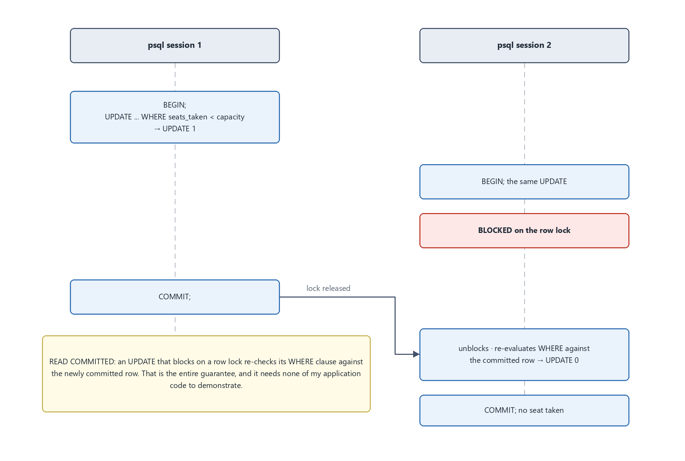
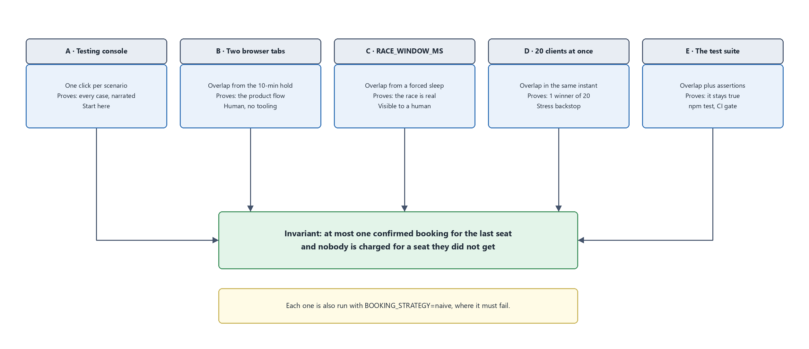
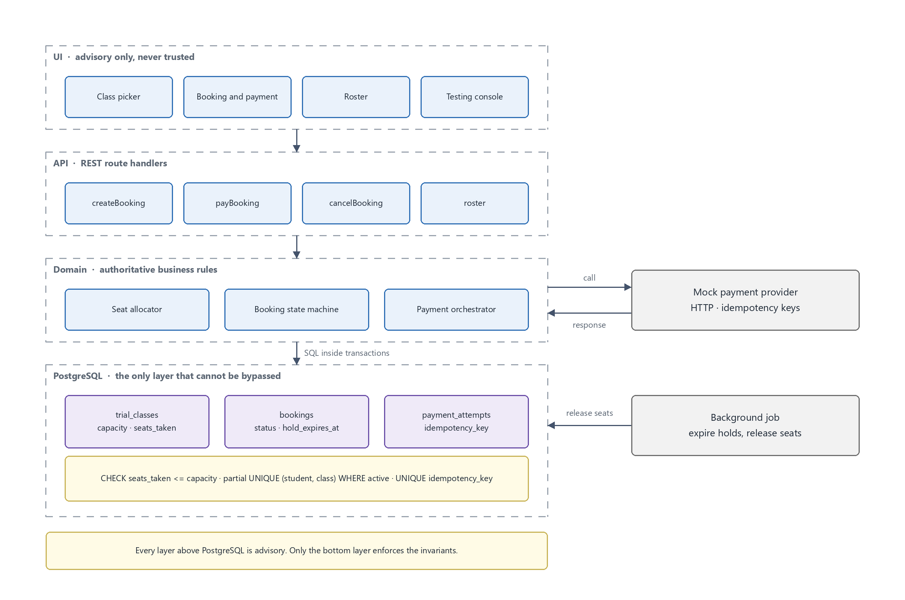
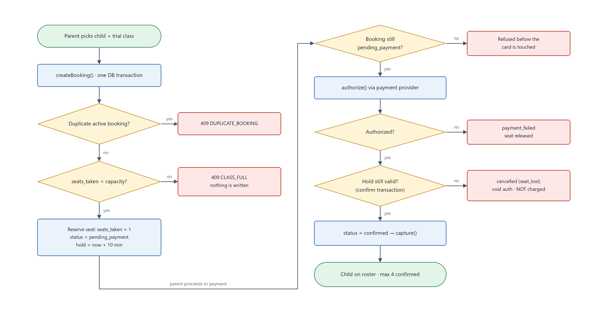
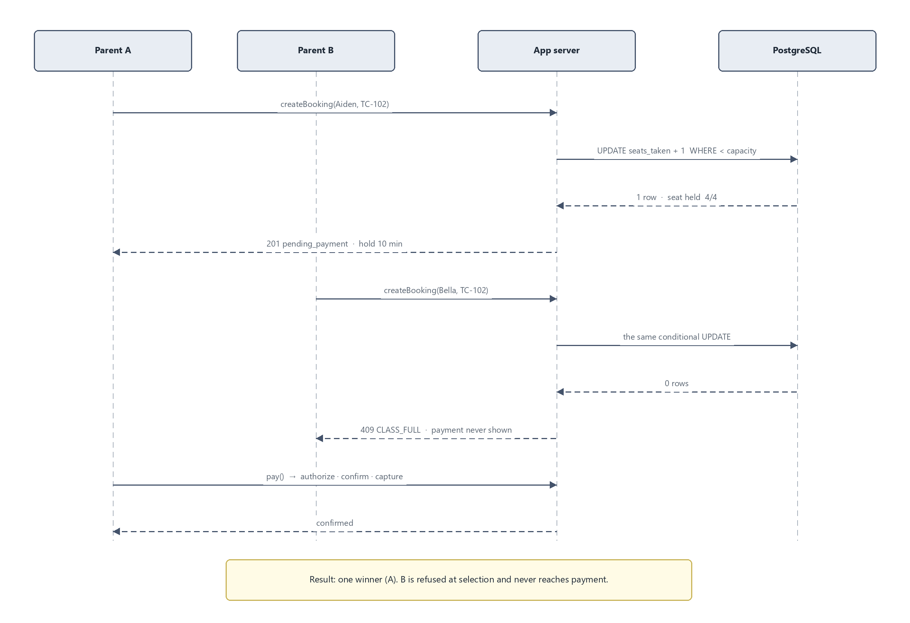
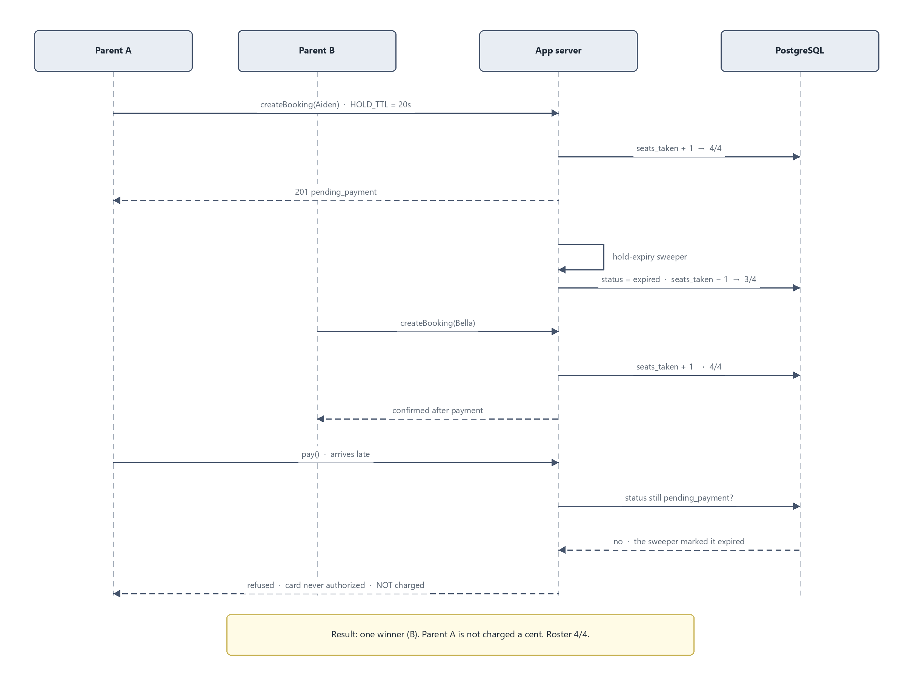

# Ottodot, trial booking POC

A trial booking slice where the 4-seat limit and the no-duplicate rule are
enforced by **the database itself**, seats are reserved at checkout with an
expiring hold, money is never captured until a seat is confirmed in a committed
transaction, and every one of those claims is backed by a test you can run in
under a minute.

**Time spent: ~3 hours**, tracked per working session rather than estimated
afterwards. Roughly: 35 min on research, design and diagrams; 20 min on the
schema and its invariants; 45 min on the booking and payment domain plus tests;
the remainder on the REST layer, the UI, the testing console and these docs.
See [what I cut](#what-i-deliberately-cut).

---

## Why the invariant matters here

Ottodot runs live, teacher-led Math and Science classes for P1 to P6, delivered
over Google Meet and blended with custom Roblox games. Trial classes cap at
**4 students** and convert into a monthly subscription. Two consequences shape
every decision in this repo:

- **Overbooking is not a soft failure.** A 5th child in a 4-seat trial degrades
  the lesson for the other four, embarrasses the teacher, and does it at the
  single best conversion moment the business has.
- **Charging a parent without giving them a seat is worse than losing a
  booking.** It creates a refund, a support ticket, and a lost subscription.

So the design goal is not "handle the race." It is: *at most one confirmed
booking for the last seat, and nobody is charged for a seat they did not get.*

---

## Run it

### Fastest, nothing to install but Docker

```bash
docker compose up
```

Pulls [`syahmisani/poc-booking:latest`](https://hub.docker.com/r/syahmisani/poc-booking)
alongside Postgres, creates the schema, seeds it, and serves on
**http://localhost:3000**. No Node, no npm, no migrate step. Allow about 45
seconds the first time, most of it pulling images; a few seconds after that.
The app logs `16 classes seeded, 0 invariant violations` when it is ready.

`docker compose down` stops it. Add `-v` to throw the data away as well.

Prefer to build from this source tree rather than trust the published image?
`docker compose up --build` does exactly that.

### From source, if you want to run the tests

The test suite is not in the image, because it needs devDependencies and a
database it is allowed to truncate.

```bash
docker compose up -d db     # Postgres on :55432 (not 5432, avoids collisions)
npm install
npm run db:reset            # migrate + seed, prints the seat audit
npm test                    # 29 tests, including the concurrency suite
npm run dev                 # http://localhost:3000
```

No `.env` needed, the defaults in `src/config.ts` match docker-compose. Copy
`.env.example` if you want to change anything.

One caveat if you run both: the tests truncate the same database the app uses,
so do not run `npm test` while clicking around in the browser.

| | |
|---|---|
| **Image** | `syahmisani/poc-booking:latest` |
| **App** | http://localhost:3000 |
| **Postgres** | `localhost:55432`, user/password/db all `ottodot` |

| Page | What it is |
|---|---|
| `/` | Pick a child, pick a class, book |
| `/bookings/:id` | Booking status + payment (choose a card outcome) |
| `/roster` | Every class, with seats left |
| `/roster/:id` | What the teacher sees before class, and where a student can be removed |
| **`/testing`** | **Testing console, drive every scenario solo** |

---

## Reproducing the last-seat race in 60 seconds

A race is not a contest of speed. It is an **overlap** between the moment a
request reads the seat count and the moment it writes. If both read "3 of 4"
before either writes, both correctly conclude a seat exists and both write.
Nobody loses, they both win, and the class has 5 children in it.

That means you do not need two people or two networks. You need two requests
in flight at once, and that is manufacturable on one laptop. Four levels, in
increasing order of how much you have to trust me:

### Level 0, two `psql` windows, no application code at all

```sql
-- SESSION 1                              -- SESSION 2
BEGIN;
UPDATE trial_classes
   SET seats_taken = seats_taken + 1
 WHERE id = 'TC-102'
   AND seats_taken < capacity;
-- UPDATE 1   (holds the row lock)
                                          BEGIN;
                                          UPDATE trial_classes
                                             SET seats_taken = seats_taken + 1
                                           WHERE id = 'TC-102'
                                             AND seats_taken < capacity;
                                          -- BLOCKS. Does not return.
COMMIT;
                                          -- unblocks, re-checks WHERE against
                                          -- the committed row: UPDATE 0
                                          COMMIT;   -- no seat taken. Correct.
```

Open two terminals with
`docker compose exec db psql -U ottodot -d ottodot` and paste. No local `psql`
needed, it runs inside the database container.

The load-bearing detail: under **READ COMMITTED**, an `UPDATE` that blocks on a
row lock **re-evaluates its `WHERE` clause against the newly committed row**
once the lock is released. That is the entire guarantee. A `SELECT COUNT(*)`
reads a snapshot and never re-checks anything, which is exactly why
count-then-write loses and this does not.



### Level 1, the testing console

Open `/testing` and press **20 parents · safe**, then **20 parents · naive**.

| | winners | refused cleanly | raw DB errors |
|---|---|---|---|
| `safe` | 1 | 19 | 0 |
| `naive` | 1 | 0 | **19** |

Both keep the roster at 4, because the `CHECK` constraint catches what the
naive code lets through. That containment *is* the argument for putting the
invariant in the database. Without the `CHECK`, naive puts a 5th child in the
room.

### Level 2, the test suite

```bash
npm test
```

### Level 3, two browser tabs

1. `npm run db:reset`, TC-102 now has 1 seat left
2. Tab 1: book **Racer 1** onto TC-102 → held, seats 4/4
3. Tab 2 (incognito): book **Racer 2** onto TC-102 → **CLASS_FULL**, and they
   never reach the payment screen
4. `/testing` → *Expire this hold* with tab 1's booking id → *Run hold sweeper*
5. Tab 2 books and pays → confirmed
6. Tab 1 pays → refused, **not charged**



The levels above are ordered by how much you have to trust me. The diagram is
the same material grouped by *mechanism*: how each one manufactures the overlap,
and what each one is therefore able to prove.

### Make the tests fail on purpose

A test suite nobody can break is a test suite nobody should believe.

- Run any race with `strategy: "naive"`, the clean-refusal count must drop to 0.
- Change `capacity` to 1 in the seed and re-run, every invariant must still hold.

---

## Backend design



### Data model

| Table | Key columns |
|---|---|
| `parents` | id, name, email |
| `students` | id, parent_id, name, level |
| `trial_classes` | id, subject, level, starts_at, teacher_name, **capacity**, **seats_taken**, price_cents |
| `bookings` | id, student_id, trial_class_id, **status**, **hold_expires_at**, confirmed_at, cancelled_reason |
| `payment_attempts` | id, booking_id, **idempotency_key**, amount_cents, status, provider_ref, failure_code |

Three constraints do the real work, all in
[`db/migrations/001_schema.sql`](db/migrations/001_schema.sql):

```sql
-- 1. A class can never be overbooked, whatever the app code does.
CHECK (seats_taken >= 0 AND seats_taken <= capacity)

-- 2. One child, one live booking per class. PARTIAL on purpose: failed and
--    expired rows stay for audit and must not block a legitimate retry.
CREATE UNIQUE INDEX bookings_one_active_per_student_class
  ON bookings (student_id, trial_class_id)
  WHERE status IN ('pending_payment', 'confirmed');

-- 3. A retried payment is the SAME payment.
CREATE UNIQUE INDEX ON payment_attempts (idempotency_key);
```

There is also a `class_seat_audit` view that detects **counter drift**, not just
overbooking. The test suite asserts it after every single test, and
`npm run db:audit` runs it by hand.

### Booking statuses

| Status | Holds a seat? | Meaning |
|---|---|---|
| `pending_payment` | **yes** | Seat reserved, parent in checkout, hold has a TTL |
| `confirmed` | **yes** | Payment captured, child is on the roster |
| `payment_failed` | no | Declined; seat released; retry allowed |
| `expired` | no | Hold lapsed; seat released by the sweeper |
| `cancelled` | no | Abandoned, or seat lost before capture |

Only two statuses occupy a seat, and both are counted in `seats_taken`. Every
transition out of a seat-holding status releases exactly one seat, in the same
transaction.

### API

| Endpoint | Notes |
|---|---|
| `GET /api/trial-classes` | `seats_available` is **advisory** |
| `POST /api/bookings` | 409 `DUPLICATE_BOOKING` / 409 `CLASS_FULL` |
| `GET /api/bookings/:id` | status + payment attempts |
| `POST /api/bookings/:id/pay` | 402 `PAYMENT_FAILED`, 409 `SEAT_LOST`, 504 timeout |
| `GET /api/classes/:id/roster` | confirmed only |
| `POST /api/mock-provider/{authorize,capture,void}` | the fake PSP, over real HTTP |
| `POST /api/testing` | testing console backend; would not ship |

### How the last-seat race is prevented



**Two independent mechanisms, either one sufficient alone.**

**1. Reserve at selection, not at payment.** `createBooking` takes the seat when
the parent starts checkout, in one transaction:

```sql
UPDATE trial_classes SET seats_taken = seats_taken + 1
 WHERE id = $1 AND seats_taken < capacity;
-- 0 rows affected => CLASS_FULL => rollback, no booking, no seat
```

Read and write are the *same atomic statement*, so there is no window between
them. A second transaction blocks on the row lock, then re-evaluates its
`WHERE` against the committed row and backs off.

**2. Re-verify before capture.** Even if a hold lapsed and someone else took the
seat, `payBooking` re-checks inside a transaction *after* authorizing and
*before* capturing. If the seat is gone: void the authorization, mark the
booking `cancelled (seat_lost)`, charge nothing.

The brief's phrasing, "B completes payment first", describes a system that
reserves at payment time. I deliberately changed that: reserving at selection is
what stops two parents from ever *reaching* the payment screen for the same
seat. If that product call is wrong, mechanism 2 still holds the invariant.




### How duplicates are prevented

Partial unique index, not application logic. The subtlety is the `WHERE` clause:
a plain unique index would also block duplicates *and* permanently lock a parent
out after one declined card. There is a test for exactly that.

### How payment failure is handled

**Money is only ever captured strictly after a booking reaches `confirmed` in a
committed transaction.** Everything else is authorize-and-void.

| Failure | Handling | Parent |
|---|---|---|
| Declined at authorize | seat released in the same transaction | not charged, may retry |
| Authorized, seat lost | **void**, never capture | not charged |
| Provider timeout | retry with the same idempotency key | one charge, not two |
| Double submit / replay | already-confirmed returns success | one charge, one seat |

The strongest assertion in the suite is a negative one: on the seat-lost path,
`capture` is **never called**, asserted as exactly `["authorize", "void"]`.

### Which check belongs where

| Layer | Role | Examples |
|---|---|---|
| UI | Fast feedback. Never trusted. | Grey out full classes, disable double-submit |
| API / domain | Authoritative rules, orchestration, idempotency | State machine, hold TTL, authorize→capture ordering |
| **Database** | **Invariants that survive a buggy app** | `CHECK`, partial unique index, atomic conditional UPDATE |
| Background job | Time-based repair, never the guarantee | Hold sweeper |

The sweeper is deliberately *repair only*: a late sweep delays availability, it
never permits an overbooking.

---

## Seed data

| Fixture | Demonstrates |
|---|---|
| TC-101 Science P4, 1/4 | a class with seats; Aiden already on it → duplicate case |
| **TC-102 Math P5, 3/4** | **exactly 3 confirmed, the last-seat race target** |
| TC-103 Math P3, 4/4 | a full class |
| TC-104 Science P6 | an **expired hold** + a `payment_failed` booking holding no seat |
| R-1 … R-20 | twenty unbooked P5 children, so the race is decided by seat scarcity |

Card tokens mirror Stripe's test-card convention: `tok_ok`,
`tok_fail_declined`, `tok_fail_funds`, `tok_timeout`.

---

## Tests

29 tests against **real Postgres**, concurrency proven against an in-memory
fake proves nothing.

| File | Covers |
|---|---|
| `schema.test.ts` | constraints, straight to the DB, bypassing the app |
| `booking.test.ts` | duplicates, overbooking, 20-child race under safe **and** naive |
| `payment.test.ts` | decline, seat-lost void, double submit, lost-response retry |
| `expiry.test.ts` | sweeper, plus the brief's scenario end to end |

Every test ends with an invariant sweep over **every** class, not just the one
it touched.

---

## Assumptions

- One seat per booking, one child per booking.
- Parent identity is seeded; no auth. A real build puts `parent_id` on the
  session and scopes every query by it.
- A student may only book a class at their own level.
- Prices are integer cents, SGD. No promotions (Ottodot's real BOGO trial offer
  is out of scope).
- Timestamps are `timestamptz`; the container runs Asia/Singapore.

---

## What I deliberately cut

Each of these was a decision, not an oversight:

- **Regular enrollment, subscriptions, pricing.** The brief says trial only.
- **Auth.** Would add a session layer without touching the invariants.
- **Async webhook delivery.** The provider is a real HTTP service with real
  idempotency, but `pay` calls it synchronously. The webhook shape is designed
  (signature verification, replay window) and not built.
- **Payment reconciliation job** for `unknown` attempts, the timeout path is
  handled by idempotent retry instead.
- **3DS / `requires_action`**, settlement, refunds, disputes, partial captures.
- **Waitlists, rescheduling, cancellation, emails, calendar invites.**
- **Frontend polish.** Unstyled and functional, on purpose.

### What the mock provider does and does not imitate

Faithful to the **state machine and idempotency semantics** of a real PSP, and
deliberately unfaithful to everything about money movement. Good enough to prove
the booking invariants; not good enough to take a payment.

High fidelity: authorize/capture/void with manual capture, idempotency keys,
decline codes, and the timeout-where-the-charge-landed case. Not modelled: 3DS,
settlement, FX, chargebacks, fraud checks.

The interface mirrors Stripe PaymentIntents 1:1, so swapping it is one adapter
file, and the tests are written against the *interface*, not the mock.

---

## What I would monitor after release

- **`SELECT count(*) FROM class_seat_audit WHERE NOT ok`, must be 0. Page
  immediately if it is ever not.** This should be impossible; if it fires, an
  invariant has been bypassed.
- Authorizations without a matching capture or void (money held, nothing sold).
- Hold expiry rate, a spike means checkout is broken, not that parents changed
  their minds.
- `payment_attempts` stuck in `unknown`, and their age.
- Funnel drop-off between `pending_payment` and `confirmed`.
- `CLASS_FULL` rate, high numbers mean it is time to open more trial slots,
  which is a revenue signal rather than an error.

## What I would do next

0. **Be kinder to the slow payer.** The hold expiry is correct but the
   experience around it is not. A parent unfamiliar with online checkout is
   exactly the one who runs out of time, and today they get no countdown, no
   warning, and only find out the seat is gone after entering their card. Three
   fixes, in order of value: a visible countdown with a warning before expiry;
   a hold longer than 10 minutes, since with 4 seats contention is rare and the
   cost of holding is low; and letting an expired hold be **reclaimed when the
   seat is still free**, because refusing someone a seat nobody else wanted
   helps no one. The last one is safe precisely because the reclaim would go
   through the same atomic conditional UPDATE as any other booking.
1. **Waitlist** for full classes, right now demand at a full class is thrown away.
2. **Seat rows** instead of a counter (4 rows per class, claim one) for per-seat
   audit history. Equally correct, more expensive; worth it once seats gain
   attributes.
3. Real provider webhooks with signature verification and an outbox table.
4. Auth, and scoping every query by the session's parent.
5. Contract-test the payment suite against Stripe test mode, the interface
   already allows it.
6. Admin cancellation with refunds, then reconciliation.

---

See [AI_USAGE.md](AI_USAGE.md) for how this was built.
